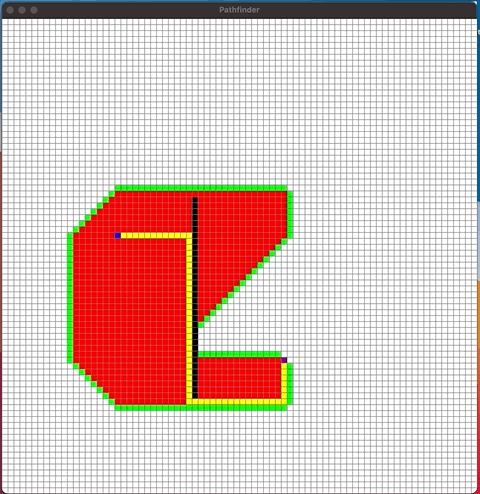

# Pathfinder
Pathfinder is a pathfinding visualisation tool that visualises the astar and dijkstra algorithms through the use of pygame.

## Installation
Install python3.9.5 or later
Use the package manager pip3 to install pygame

```bash
pip3 install pygame
```

## Usage

```bash
python3 pathfinder.py
```

To set start, end points and barriers use left-mouse button


You can run the astar algorithm by pressing the button **a** and also view how long the algorithm takes in the terminal 


<p float="left">
 
</p>

You can also clear the algorithm that has finished running with **c** and can remove start, end points and barriers with right-mouse button 




You can also run the dijkstra algorithm by pressing the button **d** and also view how long the algorithm takes in the terminal 


<p float="left">
 
</p>
